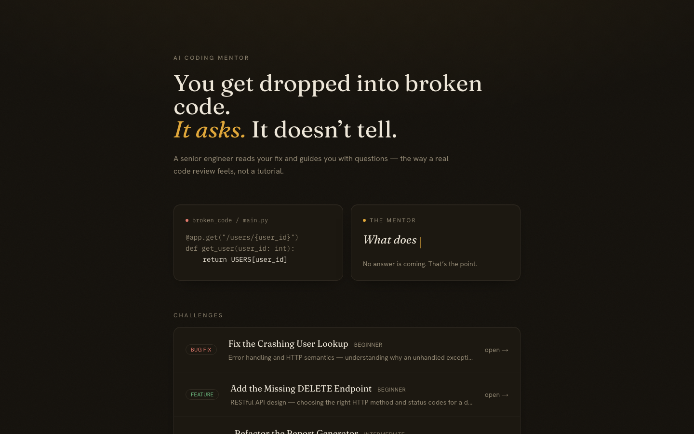
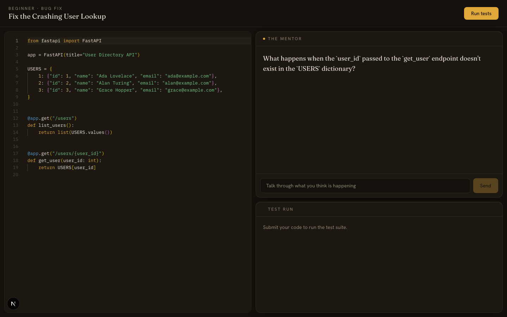

# AI Coding Mentor

You get dropped into intentionally broken code. A Socratic mentor agent asks questions until you find the fix yourself — it never gives you the answer. Pass the tests, and a second agent writes you a rubric-scored senior-engineer code review.



**Live demo:** the instance is stopped by default to preserve free-tier cloud credit — see [Running it live](#running-it-live) below for how to spin it up.

## Why this exists

Most "AI coding tutor" projects either hand over the fix outright or paste a canned explanation. Neither builds the debugging instinct a real engineer needs. This project treats that as an agent-design problem: a router classifies the task, an analysis agent privately maps the bug *without ever seeing that mapping repeated back to the user*, and a mentor agent is prompted — and structurally prevented — from revealing it. The interesting engineering is in enforcing that boundary against a model that has no built-in concept of "things I should say" vs. "things I know."

## Architecture

A 5-agent [LangGraph](https://github.com/langchain-ai/langgraph) graph, all running on NVIDIA's free-tier API Catalog (zero paid API budget — see [ADR-0004](docs/adr/0004-nvidia-free-tier-tiered-by-node.md)):

```
router → analysis → mentor ⇄ (chat loop) → execution → evaluation
                                              │
                                              └─ fails → back to mentor
```

- **router** — classifies the challenge type (bug fix / feature / refactor), metadata-first with an LLM fallback
- **analysis** — privately reasons about the bug; never emits corrected code
- **mentor** — Socratic questioning at an escalating hint level; the only agent that talks to the user
- **execution** — runs submitted code in a hardened Docker sandbox against the real test suite
- **evaluation** — rubric-scored code review, gated on the sandbox reporting a pass

The compiled graph above is the design artifact; live traffic is actually served by `backend/api/orchestrator.py` calling the same node functions directly, because the API needs a repeatable mentor↔user chat loop the graph's single edge doesn't model. The reasoning for every non-obvious structural choice like this is written down as an ADR — see [docs/adr/](docs/adr/).

**Stack:** FastAPI + LangGraph (backend) · Next.js 15 (frontend) · Docker (sandboxed execution) · Supabase (persistence) · LangFuse (observability, OTel-based v4 SDK)



## What's worth actually reading here

This isn't just a CRUD app with an LLM bolted on — the parts below are where the real engineering is, and where a lot of projects like this stop short:

| | |
|---|---|
| [`docs/security/sandbox-audit.md`](docs/security/sandbox-audit.md) | Two distinct threat models for executing untrusted student code: classic container escape (network, resource limits, capabilities) **and** prompt injection — a student's `print()` output crafted to manipulate the LLM grading it. Documents what's fixed, what's mitigated-not-closed, and why (open 70B models have no trained instruction/data privilege boundary). |
| [`docs/orchestration-review.md`](docs/orchestration-review.md) | Systematic failure-mode analysis of the 5-agent graph: infinite loops, state corruption, sandbox timeout mid-graph, where retries belong, token-cost hotspots. |
| [`docs/adr/`](docs/adr/) | Six ADRs covering why the graph doesn't serve live traffic, why agents pass state instead of calling tools, why hint-level is server-authoritative, the NVIDIA model choice (including a model ID that silently hangs — don't reintroduce it), the RLS/service-role authorization design, and the AWS deployment constraint from needing real Docker socket access. |
| [`.github/workflows/ci.yml`](.github/workflows/ci.yml) | Fast checks on every push; the slow paid/Docker integration suite is gated to manual trigger so it doesn't burn free-tier quota on every commit. |
| [`CLAUDE.md`](CLAUDE.md) | The internals doc — event-loop-bound client caching bugs, sync-only rate-limit key functions, and other things that only surface once you actually run this under load. |

## Running it locally

Requires Docker Desktop running, a free [NVIDIA API key](https://build.nvidia.com/), a free [Supabase](https://supabase.com/) project, and a free [LangFuse](https://cloud.langfuse.com/) project.

```bash
# sandbox image (once)
docker build -t coding-mentor-sandbox ./sandbox/

# backend
cd backend
uv sync
cp ../.env.example ../.env   # fill in your keys
uv run uvicorn main:app --reload --port 8000

# frontend (separate terminal)
cd frontend
npm install
npm run dev
```

Run the test suites with `uv run python -m pytest tests/test_sandbox.py -v` (needs Docker) and `tests/test_api.py -v` (real NVIDIA/Docker/Supabase calls, ~8-10 min — see `CLAUDE.md` for why nothing here is mocked).

## Running it live

This is deployed on an AWS EC2 instance, stopped between demos to stay within the free-tier credit (see [ADR-0006](docs/adr/0006-deployment-requires-docker-socket-access.md) for why it needs a real VM rather than a serverless platform — the sandbox spawns sibling Docker containers, which needs socket access most PaaS hosts don't expose). Start the instance from the AWS console and the app comes up via `docker-compose.prod.yml`.

## What this doesn't solve

Worth being upfront about: this demonstrates one specific mentoring mechanic (Socratic, non-answer-giving debugging + reviewer-style feedback) on three small, single-file toy challenges. It isn't a claim to solve "fresh graduates lack practical coding skills" at the scale that phrase usually implies — that would mean industry-scale multi-file codebases, real project ambiguity, and breadth this project doesn't attempt. See the ADRs and audit docs above for what it *does* rigorously attempt.
